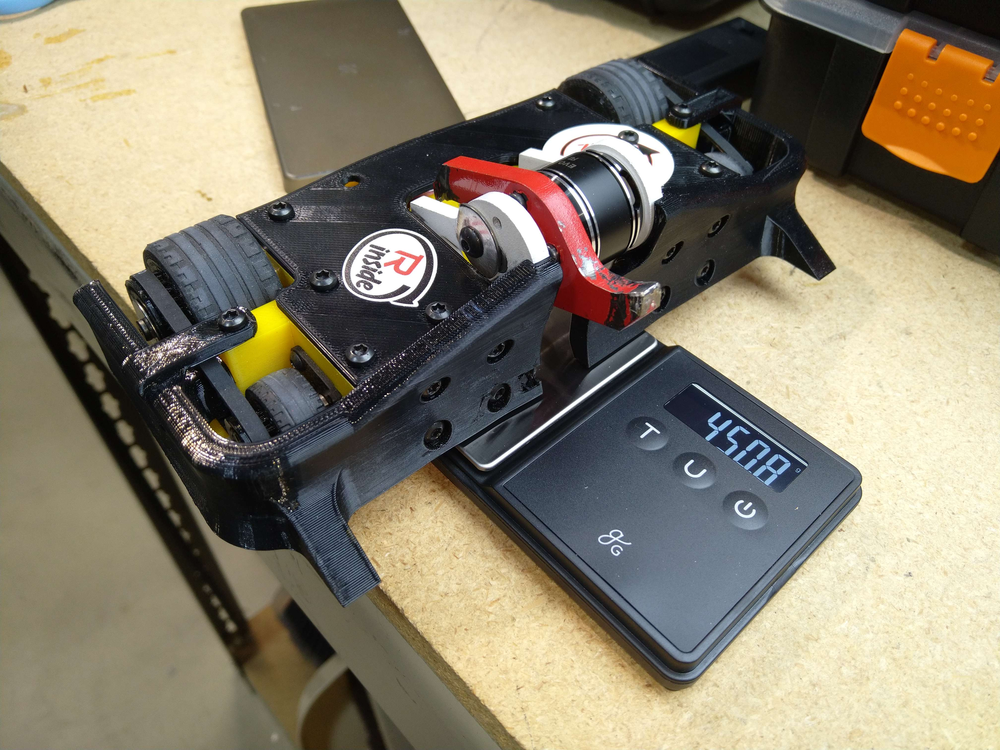
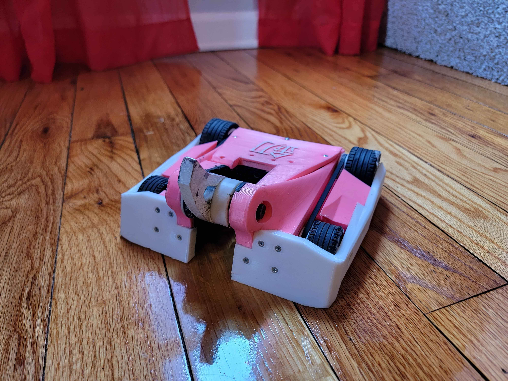
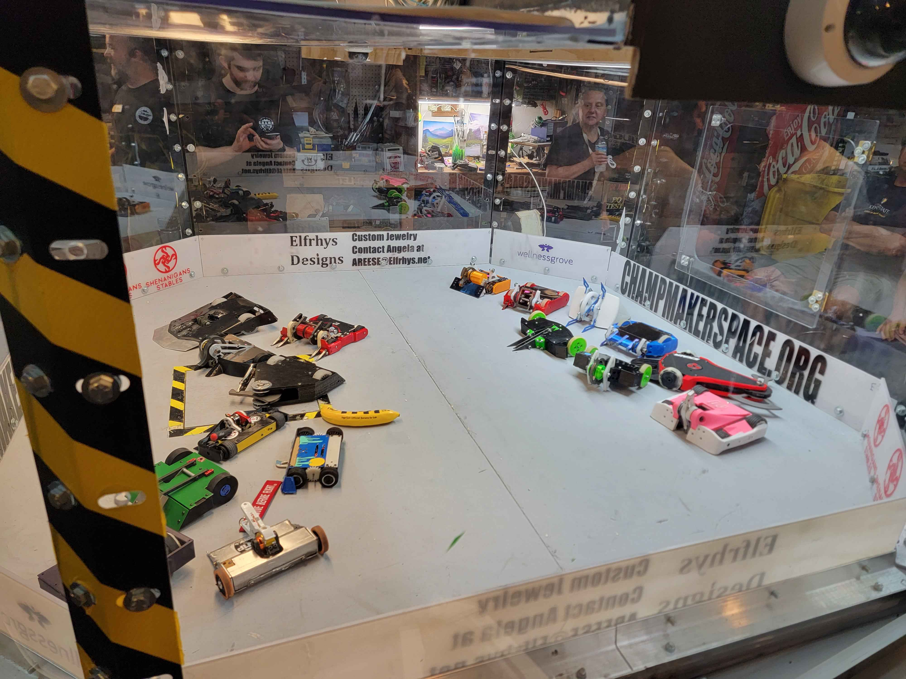
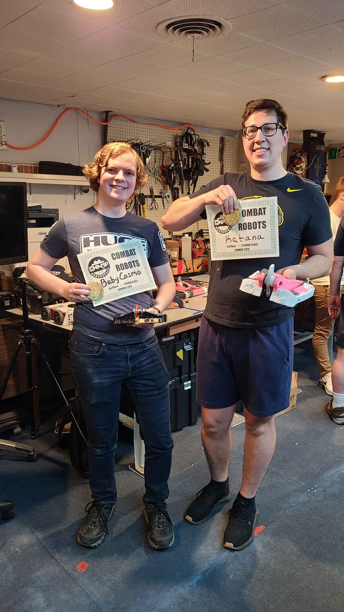

## KSU Team Members Find Success at CHAMP 

This weekend, our team member David Dreyer & alumni Brendan Steele attended Akron Makerspace's CHAMP combat event. This event hosted a number of 1 lb & 3 lb bots across the local area. Out of all the teams there, our members walked away with 1st place in both weight classes. Below is more information on each bot;

## Baby Cosmo

Baby Cosmo is Brendan's 1 lb vertical spinner bot, very much inspired by Endgame in the Battlebots show. Its initial version was debuted during our team's 1.5 lb plastic event last Fall. Brendan has worked since to make it competitive at the 1 lb full combat level.

## Katana

Katana is David's 3 lb vertical spinner bot, based on Witch Doctor and Hypershock from Battlebots. Similar to Brendan's, it first began as a 1.5 lb bot for our in-house mini-event. Following the event, David redesigned it for the 3 lb wieght class, and has taken in to several nhrl events across the last 6 months.

## Gallery

## Fight Footage

Brendan has graciously uploaded all of the fight footage to his youtube channel. The footage can be viewed [here](https://www.youtube.com/playlist?list=PLpdDIreEOr1r7lSzTuqtp38kI2Bmq885T)