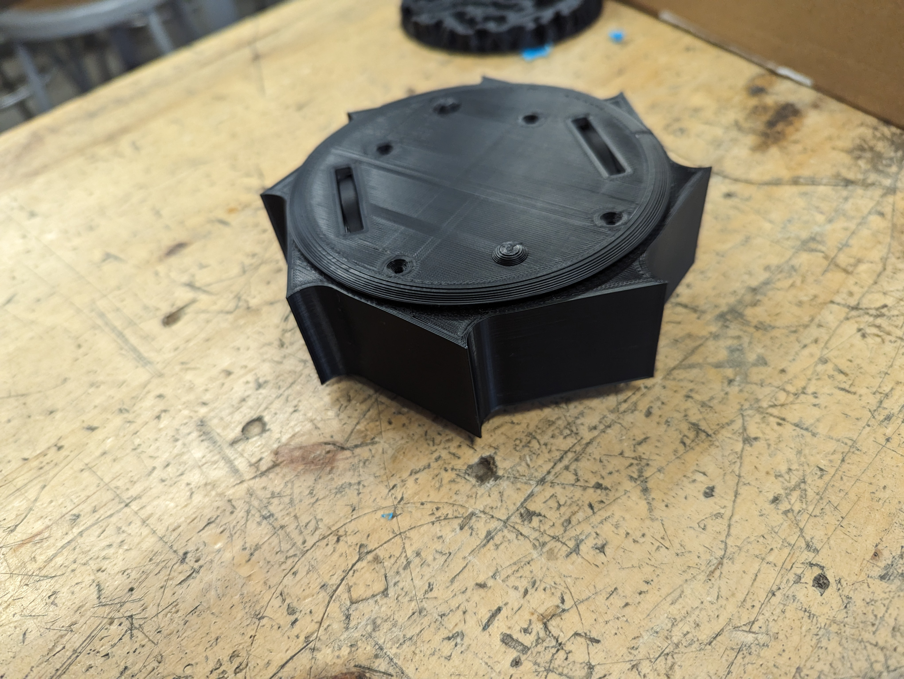
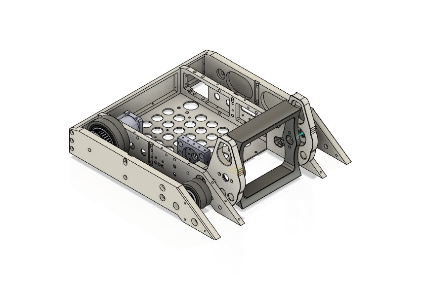

# Our Upcoming University 3lb Event

Nearing the end of the semester, it is our goal to run a 3lb plastic bot competition that would be open to competitors across Kent State.

Last year we ran a similar event, but it was 1.5lbs and only open to the members of the club, some photos are below for inspiration

This page will be updated with more information as we finalize the competition (i.e. location/date & registration)

## General Overview of our event

- We are choosing to do it as a plastic event (i.e. 3d printed except for electronics, wheels, and screws)

- Bots can weigh up to 3lb, but do not have a minimum weight requirement (though it is highly suggested to get as close as possible to the limit)

- Multi-bot configurations are allowed under our rules

- Teams can be individual, or many (we recommend no more than three to a bot)

- The club can provide discounts and 3d printing services to help make your bot a reality 

- Please have some kind of weapon lock for your bot that ensures, in the event of a communication error, everyone stays safe

A full list of the rules can be obtained [here](img/2024%20KSU%20CR%203lb%20Rules.pdf)

## We will be running multiple workshops/lessons across the semester

These will range in their content, but by the end you will have the knowledge to build your own combat robot at any weight class

- *Please remember that club membership and these workshops are only available to KSU Students*

Some lessons we can guarantee now:
- Screws, Bolts, & Nuts - an overview of the world of fasteners & McMaster Carr (hosted by Greg W.)
- Introduction to Computer Aided Design (CAD) (host tbd)
- Electronics, How Do They Work? (host tbd)
- So You Want to Build a Battlebot Eh? An overview of typical bot designs/strategies (host tbd)

## Inspiration

