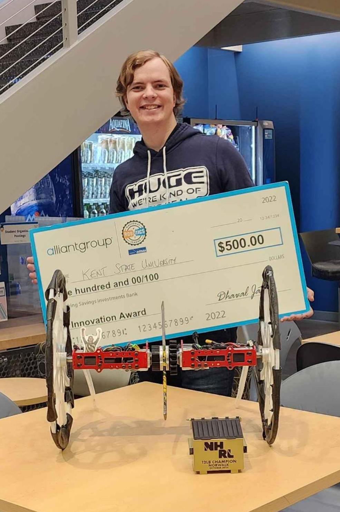
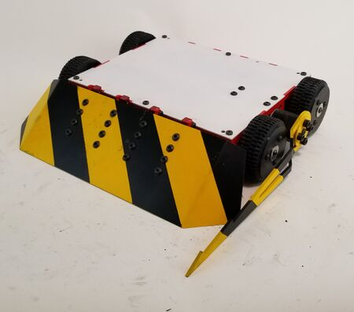
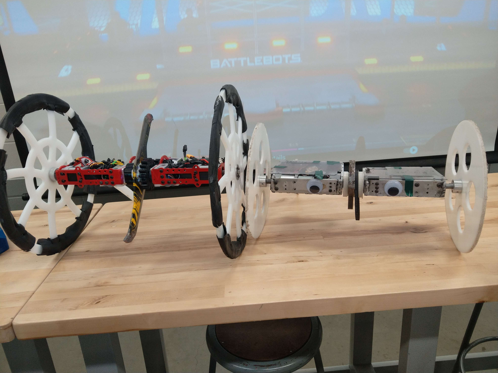

# A Gift Back To Where It All Started.

## Brendan's Gift

Brendan Steele, a former KSU Combat Robotics club member, recently brought us a $500 prize we had won several years ago out of his pocket. Brendan wanted to give back to the club to say thanks for helping him start what is now a significant part of his life. During his time in the club, Brendan helped design one of the winning bots in the past year, named Bigish. 

## His Time At Combat Robotics

Brendan has built multiple bots in the past, one of his more notiable is Ram Plan. In 2022, Ram Plan had 14 fights, going 10 to 4 with 2 KOs. During an NHRL competition, Brendan's bot managed to create a very shocking moment. In the middle of the battle, Brendan managed to use Ram Plan to turn off the House bot. This moment created a great reaction from the crowd and even warranted the clip being uploaded to the NHRL YouTube channel as a short. See here [links](https://youtube.com/shorts/fWPKl3lqlbo?si=5KW2b2X1xScrJI_c). Lucky for Brendan, doing this gave him a sweet 1,000 dollars for simply turning the house bot off.

## Where He Is Today

Later, Brendan continued to compete in battle bot competitions, most recently winning the October NHRL and going 4 in 0 with his new Huge-inspired bot Slam Plan after his time on the battle bot team Huge. Brendan improved the Huge design by adding a new aerodynamic blade, a light chassis design, and cambered extra light wheels. 
