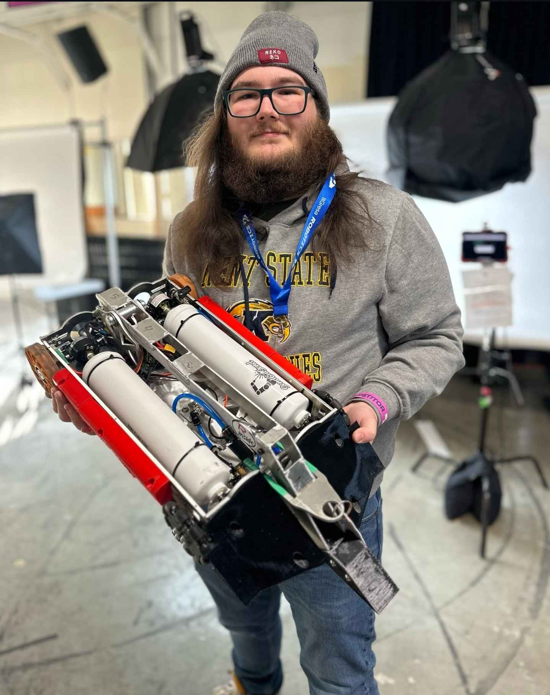
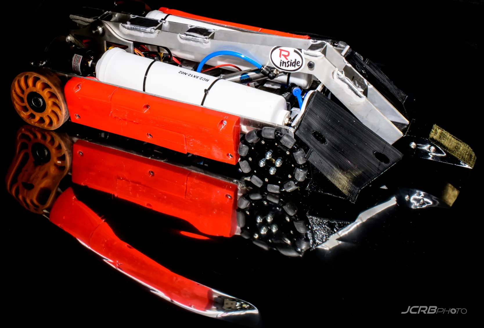

# PNUEMATADOR

## Overview
<!-- A brief description of the bot, its design, and its capabilities.-->

## Specifications
- **Weight Class:** 12 lbs
- **Body Material:** 6061 t6 Aluminum
- **Weapon:** Pneumatic Lifter, 5052 bent aluminum
- **Weapon Drive:** Pneumatic Linear Actuator
- **Drive:** Repeat Robotics Repeat Drive Magnum on banebots 4 in compliant wheels
- **Power:** 3s on drive 4s on weapon solenoid

## Competition Record

### NHRL January 2024
- **Location:** NHRL Connecticut
- **Date:** January 20, 2024
- **Fights:** 3
- **Wins:** 3
- **Losses:** 2
- **KOs:** 2
- **KO'd:** 1 

### NHRL June 2024
- **Location:** NHRL Connecticut
- **Date:** June , 2024
- **Fights:** 
- **Wins:** 0
- **Losses:** 2
- **KOs:** 
- **KO'd:** 
- **Outcome:** 

## Gallery
<!-- A section for images of the bot in action, at rest, or during competitions. -->

## Media Coverage
<!--  Links to articles, videos, or other media coverage of the bot. -->
<iframe width="560" height="315" src="https://www.youtube.com/watch?v=sXYvj-SZ_6M" title="Pneumatador vs ambiguous" frameborder="0" allow="accelerometer; autoplay; clipboard-write; encrypted-media; gyroscope; picture-in-picture; web-share" referrerpolicy="strict-origin-when-cross-origin" allowfullscreen></iframe>

## Additional Information
<!-- Any other relevant information, anecdotes, or fun facts about the bot-->

