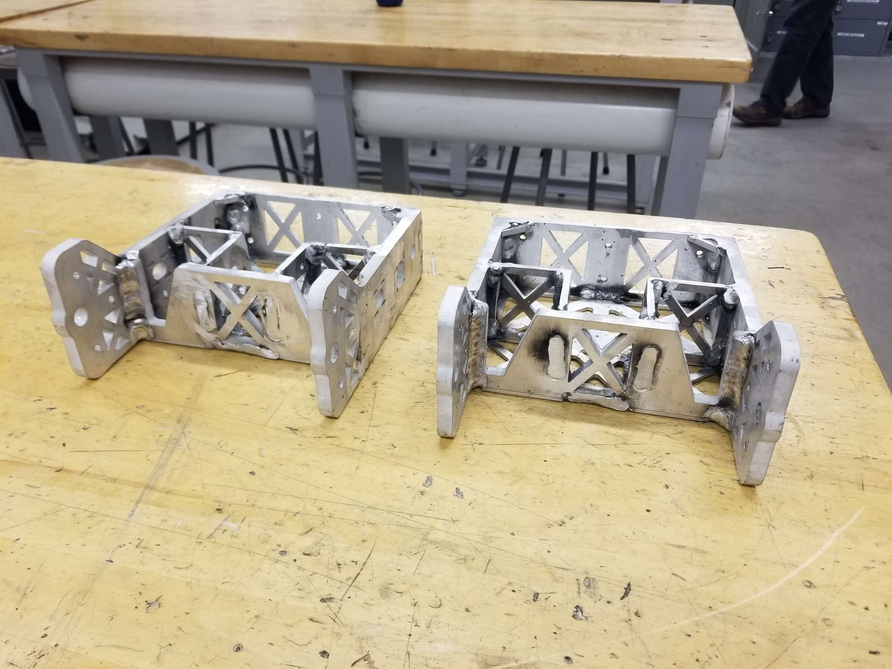
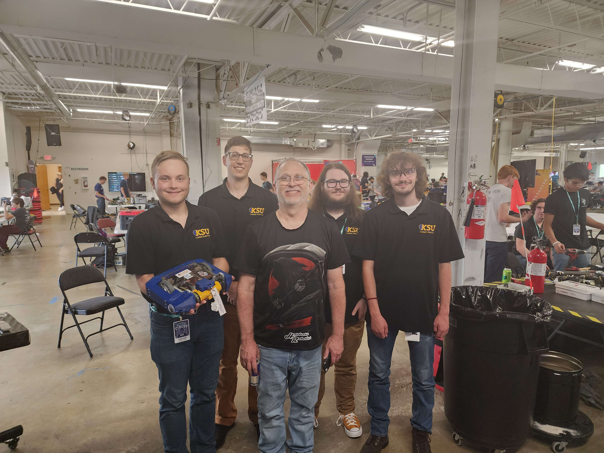
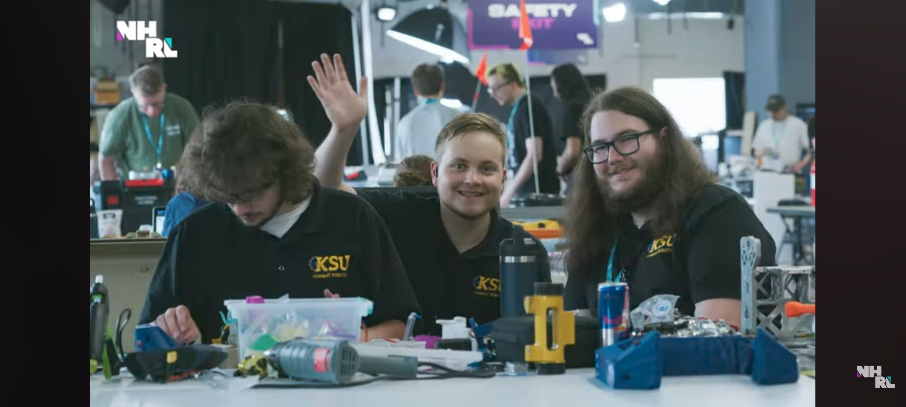
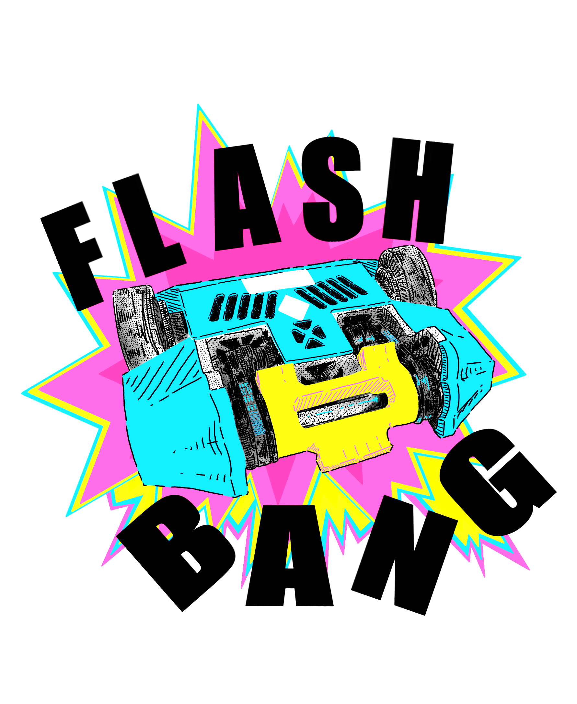

# Flash-BANG

## Overview
<!-- Insert a brief description of the bot, its design, and its capabilities.-->

## Specifications
- **Weight Class:** 12lb
- **Body Material:** Welded 6061 Aluminum, TPU Armor
- **Weapon:** 3 Tooth Welded Stack Drum
- **Weapon Drive:** BA 2826 x2
- **Drive:** Brushless Longbox
- **Power:** 6S Lipo

## Competition Record

### NHRL March 18, 2023
- **Location:** Norwalk, CT
- **Date:** March 18, 2023
- **Fights:** 3
- **Wins:** 2
- **Losses:** 1
- **KOs:** 2
- **KO'd:** 0
- **Outcome:** Rival

### NHRL June 24, 2023
- **Location:** Norwalk, CT
- **Date:** June 24, 2023
- **Fights:** 3
- **Wins:** 1
- **Losses:** 2
- **KOs:** 1
- **KO'd:** 1
- **Outcome:** Round 1

### XtremeBots 2024
- **Location:** Dayton, Ohio
- **Date:** March 22, 2024
- **Fights:** 3
- **Wins:** 0
- **Losses:** 3
- **KOs:** 0
- **KO'd:** 3

### NHRL April 3, 2025
- **Location:** Norwalk, CT
- **Date:** April 3, 2025
- **Fights:** 5
- **Wins:** 3
- **Losses:** 2
- **KOs:** 1
- **KO'd:** 2
- **Outcome:** Prelim Round 3

## Gallery
<!-- A section for images of the bot in action, at rest, or during competitions. -->

<video width="740" height="auto" controls poster="img/frame.jpg">
  <source src="/img/Flashbang_Hero_Shot.mp4" type="video/mp4" />
  Your browser does not support the video tag.
</video>

## Media Coverage
<!-- Links to articles, videos, or other media coverage of the bot. -->
Our local newspaper has covered our bot a few years ago, read about it [here](https://kentwired.com/95378/latest-updates/combat-robotics-team-continues-to-find-success/)

<iframe width="560" height="315" src="https://www.youtube.com/embed/SXWNAOSV5uQ?si=6WTQPxattuutYVdX" title="YouTube video player" frameborder="0" allow="accelerometer; autoplay; clipboard-write; encrypted-media; gyroscope; picture-in-picture; web-share" referrerpolicy="strict-origin-when-cross-origin" allowfullscreen></iframe>

## Team Members
- **Designer:** Originally designed by Austin Thebner & Gregory Wenner
- **Builder:** KSU Combat Varsity Team
- **Bot Champion:** Mike U.
- **Bot Champion History:** 
  - Mike U. (2024-Current)
  - Austin T (2022-2024)
- **Driver:** Austin T.
- **Driver History:**
  - Austin T (2022-Current)

## Additional Information
<!-- Any other relevant information, anecdotes, or fun facts about the bot -->
